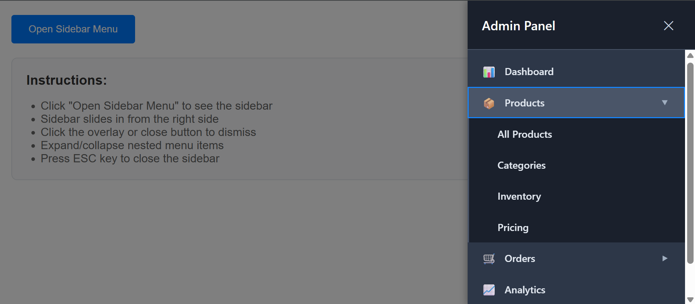

# React Component Library with Storybook

A comprehensive collection of reusable React components built with TypeScript and documented with Storybook. This library includes interactive UI components for modern web applications.

## 🚀 Live Demo

**[View Live Storybook →](https://maksym-kostetskyi.github.io/test-storybook/)**

## 📦 Components Overview

### 🔤 Input Component

A versatile input field component with advanced features:

- **Password visibility toggle** with eye icon
- **Clear button** functionality for quick input reset
- **Multiple input types** (text, password, number, email)
- **Size variations** (small, medium, large)
- **State management** (default, error, success, disabled)
- **TypeScript support** with comprehensive prop interfaces

### 🔔 Toast Component

A notification component for user feedback:

- **4 notification types** (success, error, warning, info)
- **6 positioning options** (top/bottom + left/center/right)
- **Auto-dismiss functionality** with customizable duration
- **Manual close button** option
- **Smooth animations** for appear/disappear transitions
- **Responsive design** that adapts to screen size

### 📋 SidebarMenu Component

A sophisticated navigation component with nested menu support:

- **Slide-in animation** from the right side
- **Multi-level nesting** (flat, 1-level, 2-level hierarchies)
- **Accordion-style expansion** for parent menu items
- **Backdrop close functionality** with overlay
- **Keyboard navigation** (ESC key support)
- **Responsive behavior** for mobile devices

## 🛠️ Setup Instructions

### Prerequisites

- Node.js 18+
- npm or yarn package manager

### Installation

1. **Clone the repository:**

   ```bash
   git clone https://github.com/maksym-kostetskyi/test-storybook.git
   cd test-storybook
   ```

2. **Install dependencies:**

   ```bash
   npm install
   ```

3. **Start development server:**

   ```bash
   npm run dev
   ```

4. **Launch Storybook:**
   ```bash
   npm run storybook
   ```

### Available Scripts

- `npm run dev` - Start Vite development server
- `npm run build` - Build production application
- `npm run storybook` - Launch Storybook development server
- `npm run build-storybook` - Build Storybook for production
- `npm run deploy-storybook` - Deploy Storybook to GitHub Pages
- `npm run lint` - Run ESLint for code quality

## 📸 Component Screenshots

### Input Component States

- **Password Toggle**

  

- **Error State**

  

### Toast Component Types

- **Success Toast**

  

- **Error Toast**

  

### SidebarMenu States

- **Closed State**

  

- **Open State**

  

## 🧩 Technology Stack

- **React 19.1.0** - UI library
- **TypeScript** - Type safety and better DX
- **Vite 7.0.4** - Fast build tool and dev server
- **Storybook 9.1.0** - Component documentation and testing
- **CSS3** - Custom styling with animations
- **GitHub Pages** - Hosting for live demo

## 📝 Development

### Adding New Components

1. Create component folder in `src/components/`
2. Implement component with TypeScript interfaces
3. Create corresponding CSS file
4. Add Storybook stories in `src/stories/`
5. Export component and types

### Component Structure

```
src/components/ComponentName/
├── ComponentName.tsx    # Main component file
├── component-name.css   # Component styles
└── index.ts            # Export file (optional)
```

### Story Structure

```
src/stories/
├── ComponentName.stories.tsx  # Storybook stories
└── assets/                   # Story assets
```

## 🤝 Contributing

1. Fork the repository
2. Create your feature branch (`git checkout -b feature/amazing-feature`)
3. Commit your changes (`git commit -m 'Add amazing feature'`)
4. Push to the branch (`git push origin feature/amazing-feature`)
5. Open a Pull Request

## 🔗 Links

- **Live Demo**: https://maksym-kostetskyi.github.io/test-storybook/
- **Repository**: https://github.com/maksym-kostetskyi/test-storybook
